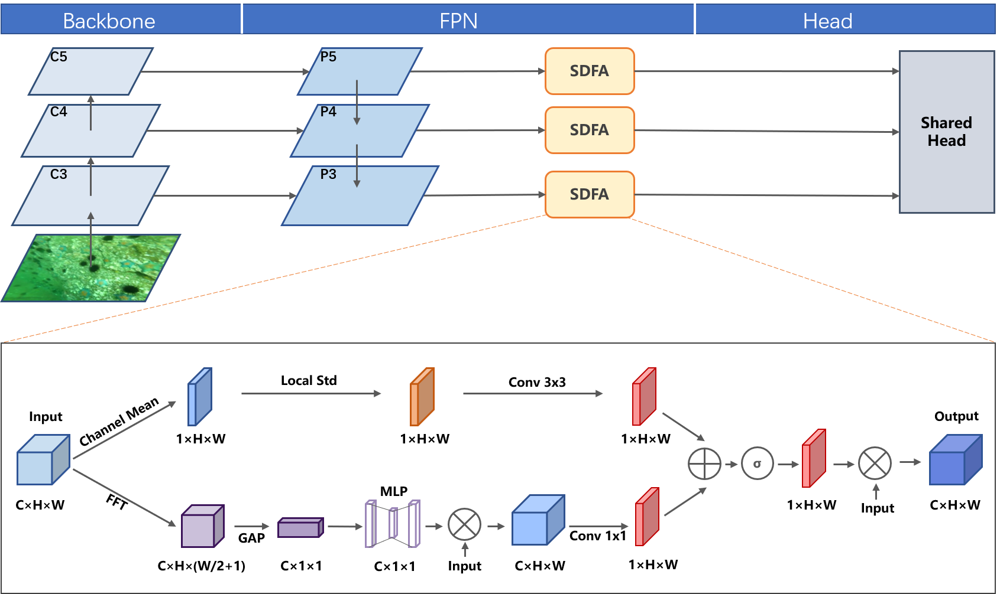

# SDFA: Spectral-Spatial Degradation Fusion Attention for Underwater Object Detection

SDFA 是一种受物理特性启发的注意力模块，专门用于解决复杂水下介质中的光学退化（衰减与模糊）问题。通过构建**空间-频率双流协同架构**，SDFA 能够有效地从严重的背景噪声中重构出鲁棒的特征表示。

## 🏗️ 网络架构 

SDFA 是一个轻量化的即插即用单元。为了最大化利用高层语义引导底层特征重构，我们建议将其部署在 **FPN (Feature Pyramid Network) 的输出后**。 下述为 SDFA 集成在 FCOS 框架下的示意图： 

## 🔍 核心动机

传统注意力机制主要依赖空间强度的统计聚合，在低信噪比（SNR）的水下环境中，往往难以区分**高强度的散射噪声**与**微弱的目标信号**。

**SDFA 通过以下双流设计解决该挑战：**

- **空间域 (Spatial Domain)**：引入**局部标准差 (Local Standard Deviation)** 机制，将精细的纹理信息从平滑的背景中脱耦，从而精准抑制焦散干扰（Caustic Interference）。
- **频率域 (Frequency Domain)**：利用**傅里叶分析 (Fourier Analysis)** 显式建模水下介质退化的光谱特性。通过自适应重校准机制，补偿被水体过滤掉的高频语义细节。

------

## ✨ 技术亮点

- **物理启发 (Physics-informed)**：基于水下光传播物理模型设计，具备极强的解释性。
- **跨域协同 (Cross-domain Synergy)**：结合了空间特征脱耦与频域频谱重校准的优势。
- **特征补偿 (Feature Compensation)**：不同于传统的特征加权，SDFA 侧重于重构并修复丢失的语义信息。
- **通用且即插即用**：作为一个轻量化单元，可无缝集成至 FCOS、YOLO 系列等主流检测器的 Neck 部分（建议放在 FPN 输出之后）。

## 📈 可视化对比

### 检测对比

通过引入 SDFA，模型在极端浑浊和低信噪比环境下的检测鲁棒性得到了显著增强。（从左至右：Ground Truth，Baseline 预测结果，**Baseline + SDFA 预测结果**）


### 特征图对比

特征图可视化证明了 SDFA 能够有效地从背景噪声中区分出目标信号，并对缺失特征进行补偿。


## 📊 实验数据 

我们在多个主流架构上进行了广泛的消融与对比实验。结果表明，**无论是单阶段、双阶段还是 YOLO 系列，SDFA 均能带来稳定且显著的性能跃升。**

| **Detector**             | **AP**   | **AP50** | **AP75** | **APS**  | **APM**  | **APL**  |
| ------------------------ | -------- | -------- | -------- | -------- | -------- | -------- |
| **Two-stage Detectors**  |          |          |          |          |          |          |
| Faster R-CNN             | 55.5     | 76.2     | 64.0     | 54.1     | 56.5     | 54.5     |
| **w/ SDFA **             | **57.6** | **78.1** | **65.9** | **60.2** | **56.8** | **54.4** |
| Cascade R-CNN            | 56.7     | 77.3     | 64.9     | 42.2     | 57.6     | 56.6     |
| **w/ SDFA **             | **58.4** | **77.9** | **66.4** | **46.4** | **59.2** | **56.3** |
| **One-stage Detectors**  |          |          |          |          |          |          |
| RetinaNet                | 51.2     | 72.4     | 63.5     | 39.0     | 54.4     | 51.0     |
| **w/ SDFA **             | **53.0** | **73.8** | **64.4** | **42.0** | **55.2** | **51.2** |
| RepPoints                | 58.0     | 79.2     | 65.4     | 41.2     | 61.5     | 56.1     |
| **w/ SDFA **             | **59.6** | **81.0** | **66.9** | **45.2** | **63.0** | **55.5** |
| ATSS                     | 58.2     | 80.1     | 66.5     | 43.9     | 60.6     | 55.9     |
| **w/ SDFA **             | **59.9** | **81.7** | **67.8** | **45.3** | **62.2** | **55.7** |
| GFL                      | 59.1     | 81.2     | 67.0     | 47.5     | 62.4     | 57.7     |
| **w/ SDFA **             | **61.8** | **83.0** | **68.0** | **48.8** | **62.0** | **58.0** |
| **YOLO Series**          |          |          |          |          |          |          |
| YOLOv5s                  | 66.0     | 86.2     | 74.9     | 44.0     | 67.7     | 64.9     |
| **w/ SDFA **             | **67.1** | **86.8** | **75.7** | **44.9** | **68.4** | **66.5** |
| YOLOv8s                  | 67.8     | 86.0     | 75.5     | 43.5     | 69.8     | 66.9     |
| **w/ SDFA **             | **68.8** | **86.7** | **76.0** | **45.8** | **70.5** | **67.8** |
| **Underwater Detectors** |          |          |          |          |          |          |
| GCCNet                   | 61.9     | 81.7     | 69.8     | 53.2     | 64.3     | 59.6     |
| **w/ SDFA **             | **62.6** | **82.3** | **70.8** | **53.6** | **65.0** | **60.4** |
| Dynamic YOLO             | 68.2     | 86.1     | 75.2     | 52.1     | 70.0     | 66.8     |
| **w/ SDFA **             | **68.7** | **86.9** | **75.5** | **53.0** | **70.4** | **67.5** |

## 🚀 快速开始 

```python
import torch
from sdfa import SDFA

# 假设来自 FPN 的输入特征图尺寸为 [Batch, Channels, Height, Width]
x = torch.randn(2, 256, 64, 64)

# 实例化 SDFA 模块
sdfa = SDFA_Module(in_channels=256)

# 将特征输入 SDFA 增强
out = sdfa(x)

print(out.shape) # Output: [2, 256, 64, 64]
```

